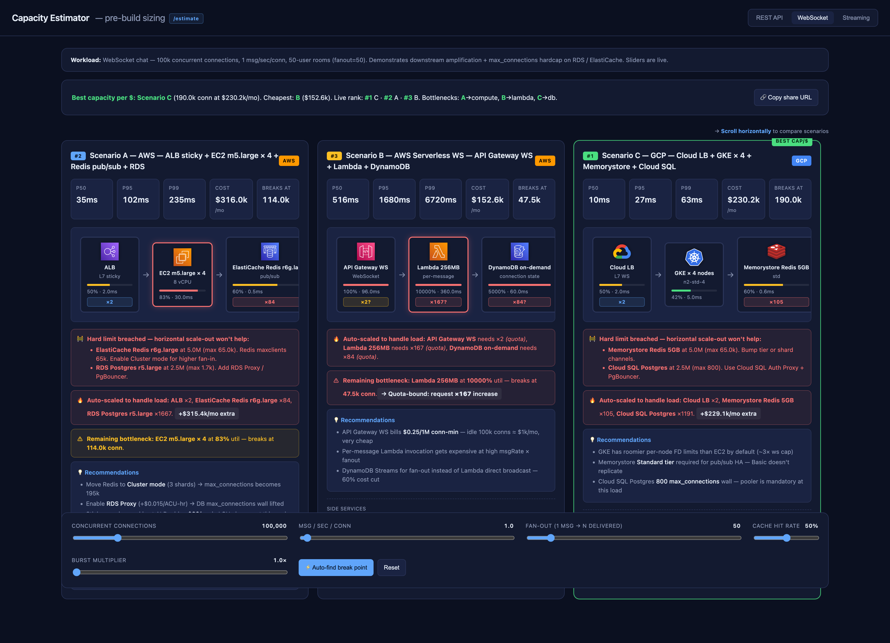

# capacity-estimator

> Pre-build architecture sizing for AWS / GCP / Azure. Sketch your stack, get back-of-envelope p50/p95/p99, monthly cost, and break-point analysis — **before you write any code**.

A `/estimate` slash command for [Claude Code](https://docs.claude.com/en/docs/claude-code) that generates an interactive HTML report comparing 2–4 candidate architectures.

**REST API mode** — typical web service, 4 scenarios across AWS / GCP / Azure / Serverless:


**WebSocket / chat mode** — connection-amplified, with `msg/sec/conn` and `fan-out` sliders + hard-cap detection (Postgres `max_connections`, Redis `maxclients`):



**Live demo (no install)** — open `mockup.html` (REST) or `mockup-ws.html` (WebSocket chat) in a browser — same UI as the slash command, prefilled with sample data.

## What it does

Given a free-form description of a workload + candidate architectures, it produces:

- Visual flow diagram of each architecture (CDN → LB → Compute → Cache/DB)
- p50 / p95 / p99 latency estimates
- Monthly cost (broken down by component)
- "Breaks at X RPS" — the load at which the first component saturates
- Sortable comparison table across all scenarios
- Live sliders to play with RPS / cache-hit-rate / burst multiplier
- WebSocket and Streaming workload modes (different inputs, different bottlenecks)

It is **not** a replacement for load testing. It is a **napkin calculator** that turns "let's just try it and see" into "here's what to expect, with the assumptions called out."

## Install

This is a **Claude Code plugin**. Install once and `/estimate` is available from any project.

**Recommended — via plugin marketplace:**

```
/plugin marketplace add https://github.com/SeungHyeon12/Claude-Infra-estimate
/plugin install estimate@capacity-estimator
```

After install the slash command is registered as `/estimate` (or, fully qualified, `/capacity-estimator:estimate`). The bundled assets (`catalog/*.json`, `template/base.html`) are resolved from the plugin install dir via `${CLAUDE_PLUGIN_ROOT}` — no symlinks, no path tweaks.

**Local development** (working on the plugin itself):

```bash
git clone https://github.com/SeungHyeon12/Claude-Infra-estimate ~/capacity-estimator
# From any project you want to size:
claude --plugin-dir ~/capacity-estimator
```

Reports are always written to `./.claude/estimates/<timestamp>.html` in the project where you ran `/estimate`, then served at `http://localhost:11131`.

## Usage

In Claude Code, two modes:

**With description** — direct, fastest:

```
/estimate REST API for user profile + recent orders, 5k RPS, AWS
/estimate WebSocket chat, 100k connections, compare AWS vs GCP
/estimate Social feed, 2M DAU, AWS vs GCP
/estimate Event ingestion 500 MB/s, Kafka vs Kinesis vs Pub/Sub
```

**Bare** — let it auto-extract:

```
/estimate
```

Scans `package.json` / `terraform/` / `k8s/` / `migrations/` / `Dockerfile` to
infer workload type, existing instance pins, and DB shape. Then proposes a
one-line hypothesis and asks one focused confirm-or-correct question before
generating the report.

The command:

1. Parses your description, or — if empty — autonomously scans the project
2. Loads catalog values for relevant services
3. Constructs 2–4 candidate scenarios
4. Computes estimates and writes `.claude/estimates/<timestamp>.html`
5. Serves it on `http://localhost:11131` and opens that URL

The static server stays up between invocations so you can re-share the URL.
Stop it with `lsof -ti tcp:11131 | xargs kill`.

## Inputs you can use

The slash command is **lenient** about what you write after `/estimate`. It cross-converts user-facing inputs to internal sliders. Pass any of these — alone or in combination:

### Load magnitude

| You write | Internal handling | Slider |
|---|---|---|
| `2M DAU` / `500k DAU` | `peak_qps = DAU × actions/user/day / 86,400 × peak_factor` (defaults: 30 actions/user, peak factor 3×; both override-able by domain hint) | Target QPS / RPS / TPS |
| `10M MAU` | `DAU = MAU × stickiness` (default 0.2; 0.5 for social, 0.6 messaging, 0.1 ecom) → then DAU rule | Target QPS / RPS / TPS |
| `5k RPS` / `5k QPS` / `500 TPS` | **Interchangeable** — all map to `capacity.rest`. Assumed *peak* unless you say "average" / "avg" / "sustained" (then ×3 peak factor applied) | Target QPS / RPS / TPS |
| `100k connections` / `100k conns` | WebSocket — concurrent connection count, maps to `capacity.ws` | Concurrent connections |
| `500 MB/s` / `2 GB/s` | Streaming throughput, maps to `capacity.stream` | Throughput MB/s |
| *(nothing)* | Asks one focused follow-up; `default` uses workload's default load (REST=5k, WS=50k, Stream=200) | (default) |

### Workload type (auto-detected, override-able)

| You write | Workload | Default sliders |
|---|---|---|
| `REST API`, `service`, `endpoint`, `payments` | REST | Target QPS / RPS / TPS · Cache hit · Burst |
| `WebSocket`, `chat`, `realtime`, `push` | WS | Concurrent conns · **msg/sec/conn** · **fan-out** · Cache hit · Burst |
| `Streaming`, `Kafka`, `Kinesis`, `event ingestion` | Stream | Throughput MB/s · Cache hit · Burst |

### Cloud / service pinning

```
… AWS                     → AWS-only scenarios
… AWS vs GCP              → side-by-side, two providers
… AWS vs GCP vs Azure     → all three (default behavior)
… AWS m5.xlarge           → pin compute tier
… RDS r5.large            → pin DB tier; same for Cloud SQL std-2, Azure SQL S3, etc.
```

### Domain hint (affects cache hit rate, R/W split, peak factor)

```
… social feed             → R/W 99:1, cache 0.95, peak 10× (event-driven)
… ecommerce browse        → R/W 95:5, cache 0.85, peak 3×
… messaging / chat        → R/W 50:50, cache 0.5, peak 2×
… payments / OLTP         → R/W 70:30, cache n/a, peak 3×
… SaaS dashboard          → R/W 90:10, cache 0.8, peak 2×
```

### WebSocket-only inputs

```
… 50-user rooms                  → fan-out 50
… 10 msg/sec/user                → msg-rate 10
… DM (1:1)                       → fan-out 1
… large public broadcast         → fan-out 1000+
```

These set `meta.initialMsgRate` and `meta.initialFanout` so the report opens with the right amplification baked in. You can move both sliders live afterward.

### Examples combining everything

```
/estimate Social feed, 2M DAU, AWS vs GCP
  → REST, peak ~3,500 QPS, 99:1 R/W, cache 0.95, AWS+GCP scenarios

/estimate Payments, 500 TPS peak, AWS, RDS r5.xlarge
  → REST, 500 RPS literal (peak), 70:30 R/W, RDS pinned

/estimate WebSocket chat, 100k connections, 50-user rooms, AWS vs GCP
  → WS, 100k conns, msg=1, fanout=50, hard-cap banners on RDS/Redis

/estimate                         (bare — auto-extract)
  → scans your repo, proposes a hypothesis, asks one confirm question
```

## What's in here

```
.claude-plugin/
  marketplace.json         # marketplace listing — points to ./plugins/estimate
plugins/
  estimate/                # the actual plugin (canonical Claude Code plugin layout)
    .claude-plugin/
      plugin.json          # plugin manifest (name, version, metadata)
    commands/
      estimate.md          # the slash command prompt
    catalog/               # JSON service catalogs (AWS, GCP, Azure) + workload patterns
    template/              # base.html — the report template (data-driven, single file)
docs/                      # architecture, catalog format, extension guide,
                           # demo screenshots (demo.png, demo-ws.png)
examples/                  # sample invocations
mockup.html                # static demo (REST mode), no Claude Code needed
mockup-ws.html             # static demo (WebSocket chat) — shows fan-out + hard-caps
```

The mockup files are generated by filling `plugins/estimate/template/base.html` with sample data — they always demonstrate the current template, never drift.

## Accuracy

Estimates are **±50%**. They are intentionally rough — the goal is to surface **order-of-magnitude differences** between architectures (e.g., "API Gateway costs $13k/mo at 5k RPS, ALB costs $16/mo"), not to predict exact production behavior.

For better accuracy:

- Refine `catalog/*.json` with your contracted pricing
- Calibrate latency/capacity values against your real metrics (see `docs/EXTENDING.md`)
- Use a Datadog/Grafana/CloudWatch MCP to feed real data back in (Phase 3, planned)

## Roadmap

- **Phase 1 (now)**: MVP slash command, 4-scenario HTML report, AWS/GCP/Azure catalogs
- **Phase 2**: Better queuing models (M/M/c), parallel-path latency, cold-start modeling
- **Phase 3**: Auto-read terraform/k8s/migrations to build scenarios from real infra
- **Phase 4**: Calibration mode (compare estimate vs Datadog/Grafana real metrics)

See [docs/ARCHITECTURE.md](docs/ARCHITECTURE.md) for design, [docs/EXTENDING.md](docs/EXTENDING.md) for adding new clouds/services.

## Contributing

PRs adding instance types, services, or whole providers are welcome. See [CONTRIBUTING.md](CONTRIBUTING.md). Catalog values are validated against [`catalog/schema.json`](catalog/schema.json) in CI.

## License

MIT — see [LICENSE](LICENSE).
