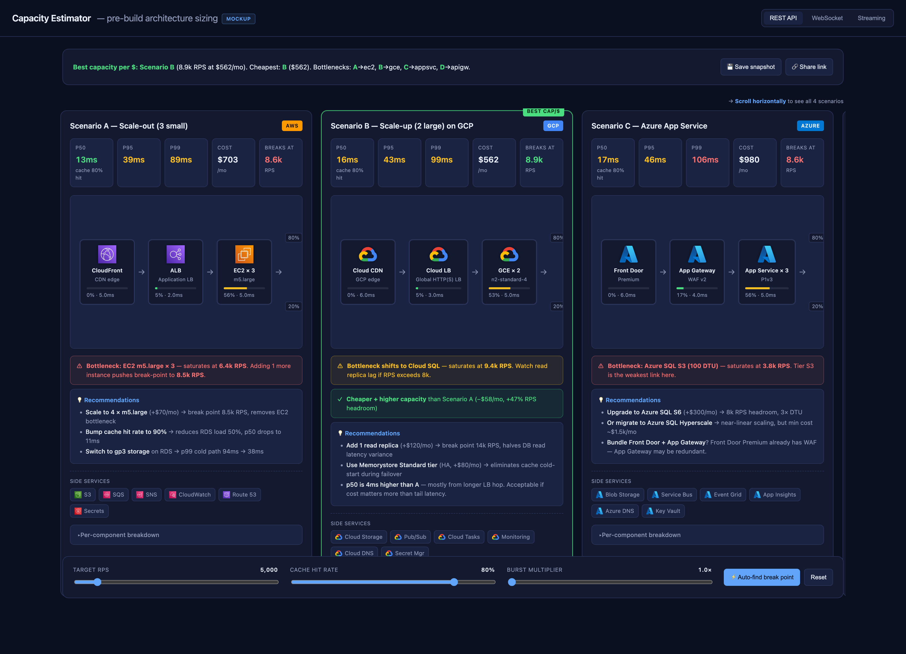

# capacity-estimator

> Pre-build architecture sizing for AWS / GCP / Azure. Sketch your stack, get back-of-envelope p50/p95/p99, monthly cost, and break-point analysis — **before you write any code**.

A `/estimate` slash command for [Claude Code](https://docs.claude.com/en/docs/claude-code) that generates an interactive HTML report comparing 2–4 candidate architectures.



**Live demo (no install):** open `mockup.html` in a browser — same UI, prefilled with sample data, no Claude Code required.

## What it does

Given a free-form description of a workload + candidate architectures, it produces:

- Visual flow diagram of each architecture (CDN → LB → Compute → Cache/DB)
- p50 / p95 / p99 latency estimates
- Monthly cost (broken down by component)
- "Breaks at X RPS" — the load at which the first component saturates
- Sortable comparison table across all scenarios
- Live sliders to play with RPS / cache-hit-rate / burst multiplier
- WebSocket and Streaming workload modes (different inputs, different bottlenecks)

It is **not** a replacement for load testing. It is a **napkin calculator** that turns "let's just try it and see" into "here's what to expect, with the assumptions called out."

## Install

This is a **Claude Code plugin**. Install once and `/estimate` is available from any project.

**Recommended — via plugin marketplace:**

```
/plugin marketplace add https://github.com/SeungHyeon12/Claude-Infra-estimate
/plugin install estimate@capacity-estimator
```

After install the slash command is registered as `/estimate` (or, fully qualified, `/capacity-estimator:estimate`). The bundled assets (`catalog/*.json`, `template/base.html`) are resolved from the plugin install dir via `${CLAUDE_PLUGIN_ROOT}` — no symlinks, no path tweaks.

**Local development** (working on the plugin itself):

```bash
git clone https://github.com/SeungHyeon12/Claude-Infra-estimate ~/capacity-estimator
# From any project you want to size:
claude --plugin-dir ~/capacity-estimator
```

Reports are always written to `./.claude/estimates/<timestamp>.html` in the project where you ran `/estimate`, then served at `http://localhost:11131`.

## Usage

In Claude Code, two modes:

**With description** — direct, fastest:

```
/estimate REST API for user profile + recent orders, 5k RPS, AWS
/estimate WebSocket chat, 100k connections, compare AWS vs GCP
/estimate Social feed, 2M DAU, AWS vs GCP
/estimate Event ingestion 500 MB/s, Kafka vs Kinesis vs Pub/Sub
```

**Bare** — let it auto-extract:

```
/estimate
```

Scans `package.json` / `terraform/` / `k8s/` / `migrations/` / `Dockerfile` to
infer workload type, existing instance pins, and DB shape. Then proposes a
one-line hypothesis and asks one focused confirm-or-correct question before
generating the report.

The command:

1. Parses your description, or — if empty — autonomously scans the project
2. Loads catalog values for relevant services
3. Constructs 2–4 candidate scenarios
4. Computes estimates and writes `.claude/estimates/<timestamp>.html`
5. Serves it on `http://localhost:11131` and opens that URL

The static server stays up between invocations so you can re-share the URL.
Stop it with `lsof -ti tcp:11131 | xargs kill`.

## What's in here

```
.claude-plugin/
  marketplace.json         # marketplace listing — points to ./plugins/estimate
plugins/
  estimate/                # the actual plugin (canonical Claude Code plugin layout)
    .claude-plugin/
      plugin.json          # plugin manifest (name, version, metadata)
    commands/
      estimate.md          # the slash command prompt
    catalog/               # JSON service catalogs (AWS, GCP, Azure) + workload patterns
    template/              # base.html — the report template (data-driven, single file)
docs/                      # architecture, catalog format, extension guide
examples/                  # sample invocations
mockup.html                # static demo, no Claude Code needed
```

## Accuracy

Estimates are **±50%**. They are intentionally rough — the goal is to surface **order-of-magnitude differences** between architectures (e.g., "API Gateway costs $13k/mo at 5k RPS, ALB costs $16/mo"), not to predict exact production behavior.

For better accuracy:

- Refine `catalog/*.json` with your contracted pricing
- Calibrate latency/capacity values against your real metrics (see `docs/EXTENDING.md`)
- Use a Datadog/Grafana/CloudWatch MCP to feed real data back in (Phase 3, planned)

## Roadmap

- **Phase 1 (now)**: MVP slash command, 4-scenario HTML report, AWS/GCP/Azure catalogs
- **Phase 2**: Better queuing models (M/M/c), parallel-path latency, cold-start modeling
- **Phase 3**: Auto-read terraform/k8s/migrations to build scenarios from real infra
- **Phase 4**: Calibration mode (compare estimate vs Datadog/Grafana real metrics)

See [docs/ARCHITECTURE.md](docs/ARCHITECTURE.md) for design, [docs/EXTENDING.md](docs/EXTENDING.md) for adding new clouds/services.

## Contributing

PRs adding instance types, services, or whole providers are welcome. See [CONTRIBUTING.md](CONTRIBUTING.md). Catalog values are validated against [`catalog/schema.json`](catalog/schema.json) in CI.

## License

MIT — see [LICENSE](LICENSE).
